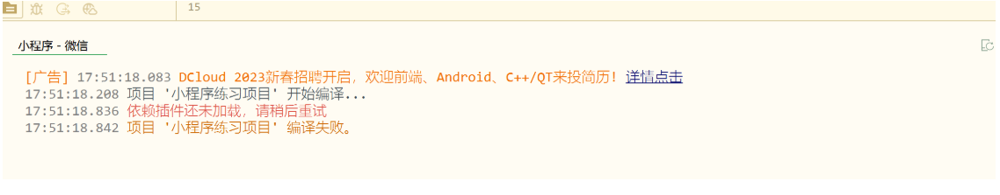
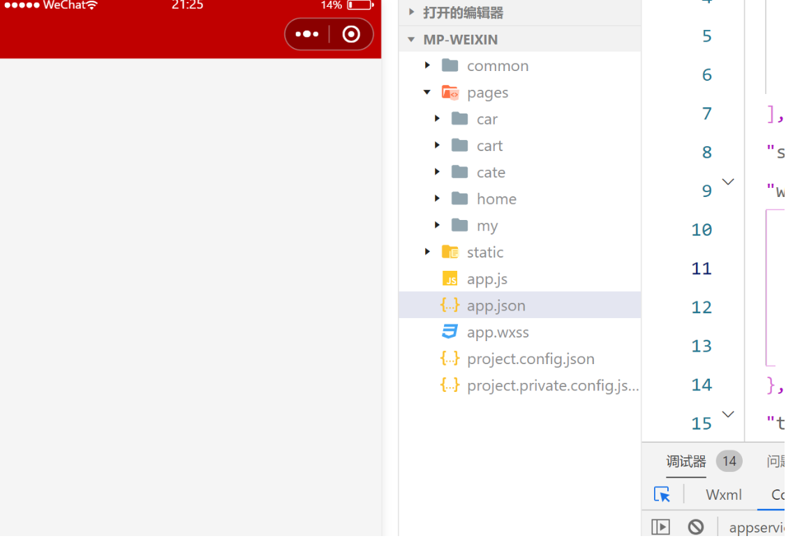

## 小程序开发中遇到的错误

### 配置环境时

1.显示编译工具下载错误，无法在微信开发者工具中运行

==处理方法==：以管理员身份运行程序，编译工具下载成功！

2.显示依赖插件还未加载



==处理方法：==重启HBuilder工具

### 设计小程序的tabbar时

1.小程序在设置全局tabbar时，globalstyl中的`navigationBarTitleText`不生效

```js
"globalStyle": {
    "navigationBarTextStyle": "white",
    "navigationBarTitleText": "优购",
    "navigationBarBackgroundColor": "#c00000",
    "backgroundColor": "#FFFFFF",
    "app-plus": {
      "background": "#efeff4"
    }
  }
```



==解决方法：==**产生了·样式覆盖造成最后结果不生效**。在生成页面时选择了生成json文件，默认没有标题。

```js
 "pages": [{
    "path": "pages/home/home",
    "style": {
      "navigationBarTitleText": "",
      "enablePullDownRefresh": false
    }

  },
```

### 设置分类页面时

1.在设计`::before`伪类元素时，元素样式不生效

==解决方法==:要在其样式中添加`content`元素占位

```css
&::before{
          content:' ';
          display: block;
          background-color: #c00000;
          width: 3px;
          height: 30px;
          position: absolute;
          top: 50%;
          left: 0%;
          transform: translateY(-50%);
```

2.在给标签`scroll-view`设置`scrollTop`属性时，属性并不生效。

==解决办法==：要给所在的`scroll-view`标签设置合适的高度。在此项目中要将高度样式设置为行内样式，因为要用到自定义变量值`wh`，所以在css中无法引用自定义的变量，导致标签高度一直无法生效。

```js
   <scroll-view scroll-y="true" class="right-scroll" :style="{height:wh+'px'}" scroll-top="400px">
```

​	==注意点：==在给`style`绑定动态样式时，要加{}。例如：==:style="{height:wh+'px'}"==

​	==注意点：==在vue项目中，js中调用变量或者函数，一定要加上`this`！！！


### 购物车组件

1开发购物车组件时，在设置vuex时出现错误，错误内容如下：

> 1.首先写==import Vue from ‘vue’==时，要记得from后面跟的是加==vue==的全小写形式
>
> 2.要记得在解构mapState时，要放在==computed==属性中进行解构，
>
> 2.解构mapMutations时，在==method==当中解构。

